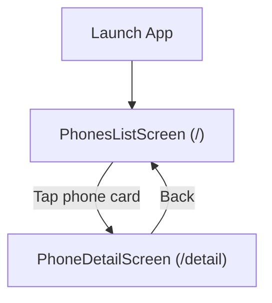

# Data Model & Navigation

## Data Model
The app displays a simple set of mobile phones with the following attributes:
- id: String
- brand: String
- model: String
- price: double (formatted with intl for display)
- photoUrl or assetPath: String

A simple in-memory list or locally bundled JSON/asset can back the list. No backend or auth is used.

### Sample Dart model
```dart
class Phone {
  final String id;
  final String brand;
  final String model;
  final double price;
  final String imageAsset;

  const Phone({
    required this.id,
    required this.brand,
    required this.model,
    required this.price,
    required this.imageAsset,
  });
}
```

## Navigation Flow
- Start at the phones list screen ("/")
- Tap a phone card to navigate to detail screen ("/detail")
- Pass the selected Phone as an argument or read from a Provider

### Mermaid: Navigation


## State Management
- Provider (declared in pubspec) can be used for minimal state:
  - Selected phone
  - UI preferences (optional)
- Follow Flutter Async Context critical rules:
  - Do not use BuildContext or widget objects after await
  - Update only primitive state variables from async methods
  - Drive UI updates from build() based on state flags

## Assets and Formatting
- Images should be placed under assets/ and declared in pubspec.yaml (already configured)
- Use intl for price formatting:
```dart
import 'package:intl/intl.dart';

final currency = NumberFormat.simpleCurrency();
final priceText = currency.format(phone.price);
```
